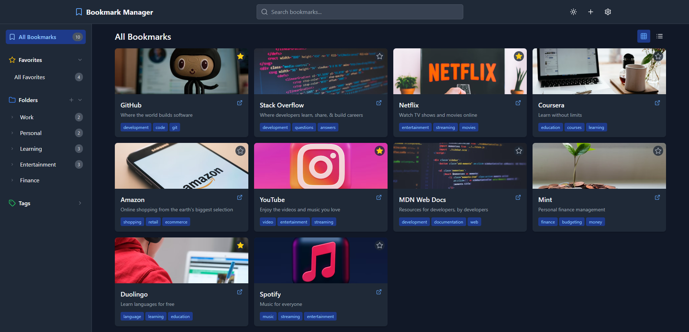
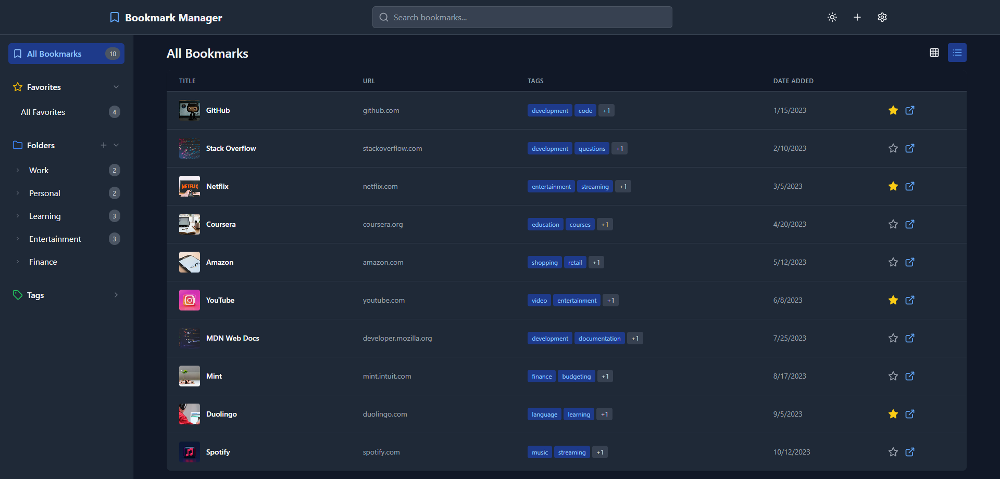
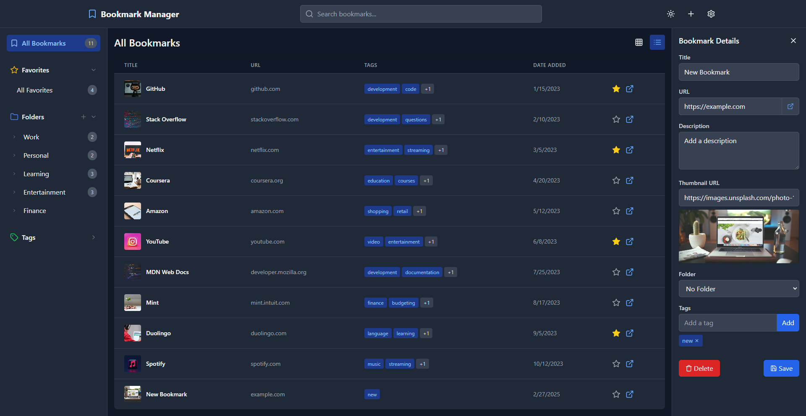
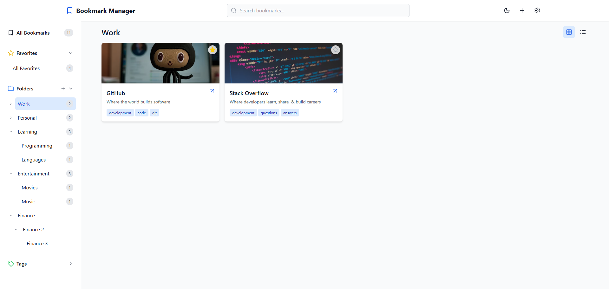

# 📑🔖 Bookmarks Manager (UI)

A modern, web-based **bookmark manager** built with **Vite, React, and TypeScript**, allowing users to organize bookmarks into folders and topics with a clean and intuitive UI.

## 🚀 Features

- 📂 **Organize Bookmarks** – Categorize bookmarks into folders/topics.
- 🔍 **Search Functionality** – Quickly find bookmarks by title or tags.
- 📌 **Grid/List View** – Switch between different layouts for better visualization.
- 🖼 **Thumbnail Previews** – View bookmarks with preview images.
- 🎨 **Modern UI with TailwindCSS** – Clean and responsive design.
- ⚡ **Built with Vite** – Super-fast development experience.

## 🛠 Tech Stack

- **Frontend**: React, TypeScript, TailwindCSS
- **Backend**: [Bookmarks Manager API](https://github.com/guibranco/bookmarks-manager-api)
- **Build Tool**: Vite
- **Icons**: Lucide React
- **Linting & Formatting**: ESLint, TypeScript ESLint

## 📦 Installation

Clone the repository and install dependencies:

```bash
# Clone the repo
git clone https://github.com/guibranco/bookmarks-manager-ui.git
cd bookmark-manager

# Install dependencies
npm install
```

## 🔧 Usage

Run the development server:

```bash
npm run dev
```

Build for production:

```bash
npm run build
```

Preview the production build:

```bash
npm run preview
```

## 📸 Screenshots

### Dark Theme - Grid view



### Dark Theme - List view



### Dark Theme - Add New Bookmark



### Light Theme - Tree Structure



## 📜 License

This project is licensed under the [MIT License](LICENSE).

---

💡 **Contributions are welcome!** Feel free to submit issues or pull requests to improve the project. 🚀
